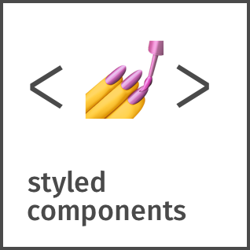

<h1 align="center">Hi There 👋, I'm Suman Islam</h1>
<h3 align="center">Web Dev | JavaScript lover | Tech Enthusiast</h3>

### Front-End Dev | JavaScript | React.js | Node.js
- 🔭 I’m currently working on **React & Node Projects**

- 🌱 I’m currently learning **Node.js and Express**

- 👨‍💻 All of my projects are available at [https://github.com/SumanIslam/](https://github.com/SumanIslam/)

- 📫 How to reach me **sumanislam1416@gmail.com**

- ⚡ Fun fact **Love to sleep**

### 🙋‍♀️ Let's Connect

 

### 🛠 &nbsp;Tech Stack

&nbsp;
&nbsp;
&nbsp;
&nbsp;
&nbsp;
&nbsp;
&nbsp;
&nbsp;
&nbsp;
&nbsp;
&nbsp;
&nbsp;
&nbsp;
&nbsp;
&nbsp;

 
 
 

[twitter]: https://twitter.com/SumanIs60417396
[facebook]: https://www.facebook.com/sumanislam.raju/
[codepen]: https://codepen.io/Suman_Islam
[linkedin]: https://www.linkedin.com/in/sumanislam/

### Show some ❤️ by starring some of the repositories!
